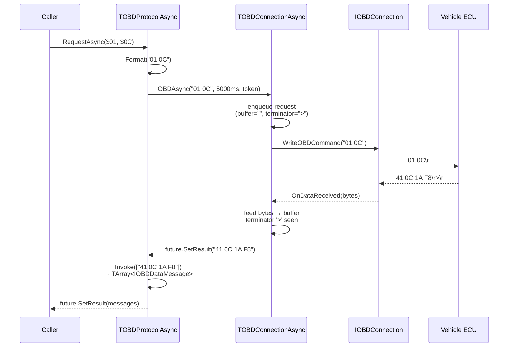
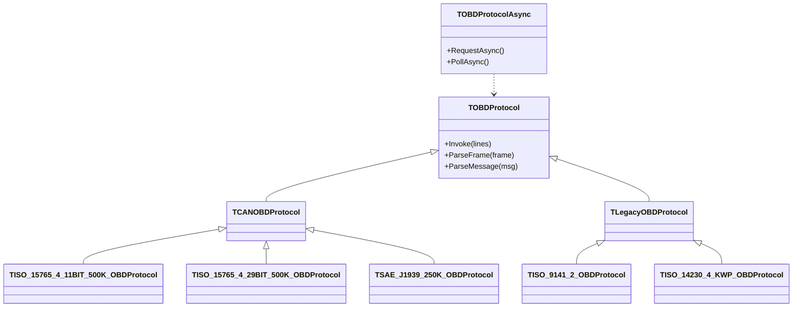
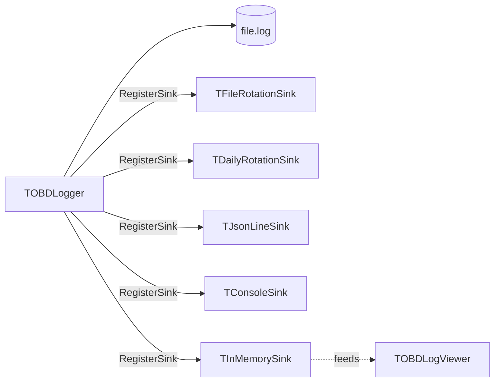

# Architecture

This is the 10,000-foot view of how the pieces fit together. For the
"how do I add a component" answer, see
[`COMPONENT_AUTHORING.md`](COMPONENT_AUTHORING.md). For protocol details
see [`PROTOCOLS.md`](PROTOCOLS.md).

---

## Layered model

The framework is four loosely-coupled layers stacked from physical
transport up to the user-visible UI. Each layer talks only to its
neighbours, so swapping (say) BLE for serial leaves protocol and
service code untouched.

```mermaid
flowchart LR
  UI[Visual components<br/><sub>CircularGauge, Tachometer, TrendGraph,<br/>DtcList, Terminal, LogViewer …</sub>]
  Service[Service layer<br/><sub>Service 01–0A encoders/decoders</sub>]
  Protocol[Protocol layer<br/><sub>CAN / KWP2000 / UDS / DoIP / J1939 / …</sub>]
  Adapter[Adapter layer<br/><sub>ELM327, OBDLink, AT/ST, J2534 PassThrough</sub>]
  Connection[Connection layer<br/><sub>Serial, Bluetooth (RFCOMM + BLE),<br/>WiFi, FTDI, UDP</sub>]
  Vehicle[(Vehicle ECU)]

  UI -->|"binds to message events"| Service
  Service -->|"hex command / parsed messages"| Protocol
  Protocol -->|"line-buffered ASCII"| Adapter
  Adapter -->|"OnDataReceived bytes"| Connection
  Connection <-->|"physical link"| Vehicle
```

---

## Data flow: a single PID poll

A typical "read engine RPM" call exercises every layer. The async
wrapper handles end-to-end correlation; legacy sync code uses the same
plumbing but blocks on the next response.



---

## Connection layer

| Unit | Transport | Notes |
|---|---|---|
| `OBD.Connection.Serial` | RS-232 / virtual COM | Standard Win32 serial. Default for ELM327 USB cables. |
| `OBD.Connection.Bluetooth` | Bluetooth RFCOMM (SPP) | Classic SPP profile via `System.Bluetooth.TBluetoothManager`. |
| `OBD.Connection.BLE` | Bluetooth Low Energy (GATT) | FFE0/FFE1 default, NUS constants, override-able UUIDs. *(v2.1)* |
| `OBD.Connection.Wifi` | TCP | For ELM327 WiFi adapters (port 35000 default). |
| `OBD.Connection.FTDI` | FTDI USB | Direct D2XX. For high-throughput logging adapters. |
| `OBD.Connection.UDP` | UDP / DoIP | ISO 13400 Ethernet diagnostics. |
| `OBD.Connection.Async` | wrapper | Resolves `IOBDFuture<string>` per command using the ELM prompt as terminator. *(v2.3)* |

Every concrete connection inherits from `TOBDConnection` and presents
`Connect`/`Disconnect`/`WriteATCommand`/`WriteOBDCommand` plus
`OnDataSend` / `OnDataReceived` / `OnError` events.

The non-visual `TOBDConnectionComponent` exposes connection settings as
published properties so a form designer can wire transport + adapter
parameters without code.

---

## Adapter layer

```
OBD.Adapter.Types          enums & records (TOBDAdapterType etc.)
OBD.Adapter.ATCommands     107 AT command constants + FormatATCommand
OBD.Adapter.STCommands     STN-series command constants
OBD.Adapter.ELM327         core ELM327 / clone driver
OBD.Adapter.ELM327.Detection  chip-type detection (genuine vs clone vs STN)
OBD.Adapter.OBDLink        OBDLink-specific extensions
OBD.Adapter.PassThrough    J2534 wrapper (partial)
OBD.Adapter.Enumerator     adapter discovery
```

The adapter sits **above** the connection. It knows about ELM-style
prompts, AT/ST command syntax, and timeouts; it doesn't know about
USB vs Bluetooth.

---

## Protocol layer

`TOBDProtocol` is abstract — every transport-on-the-wire layout
(11-bit CAN, 29-bit CAN, KWP2000, etc.) is a concrete subclass.
`Invoke(Lines: TStrings)` is the single entry point: it splits raw
ASCII lines into frames (`ParseFrame`), groups by ECU TxId, and
assembles complete messages (`ParseMessage`, including ISO-TP
multi-frame reassembly).



---

## Service layer (SAE J1979)

`OBD.Service.{01..0A}` units host the high-level helpers for each OBD-II
mode. They sit on top of the protocol layer, packaging the parsed
`IOBDDataMessage` arrays into typed records (RPM, MAF, DTCs, VIN…).

`OBD.Request.Encoders` and `OBD.Response.Decoders` are the lower-level
primitives every service uses — they translate between raw byte arrays
and the SAE J1979 PID semantics (e.g. RPM = ((A·256)+B)/4).

`OBD.Service.Recorder` belongs here too: it's a passive observer that
captures send/receive traffic into a `.obdlog` file for later replay.

---

## Async stack

```mermaid
flowchart TB
  subgraph "OBD.Async"
    Token[IOBDCancellationToken]
    Future["IOBDFuture#60;T#62;"]
    Promise["IOBDPromise#60;T#62;"]
    Future <|-- Promise
    Token -.shared by.- Future
  end
  CA[TOBDConnectionAsync] -- "returns" --> Future
  PA[TOBDProtocolAsync] -- "wraps" --> CA
  PA -- "returns" --> Future
```

Cancellation tokens are passed by reference through every layer so a
single `Cancel` propagates to in-flight connection writes, queued
protocol parses, and pending poll batches.

---

## Logging stack



Sinks are best-effort: a slow or throwing sink can't take down the
logger because dispatch happens outside the lock and inside a try/swallow.

---

## UI layer

Every visual component extends `TOBDCustomControl` (a `TSkCustomControl`
subclass). Rendering goes straight to the supplied `ISkCanvas` via
`PaintSkia(Canvas)`. The base class fires `Invalidate` at
`FramesPerSecond` Hz so animated components can interpolate from
wall-clock time inside `PaintSkia` (see
[`COMPONENT_AUTHORING.md`](COMPONENT_AUTHORING.md) for the pattern).

`TOBDTheme` is a colour palette object with role-named slots (chrome /
plot / accent / severity / selection) and per-component `Apply`
overloads. `ApplyToTree(Form)` recursively themes a whole control
hierarchy.

---

## Where to read next

- [`COMPONENT_AUTHORING.md`](COMPONENT_AUTHORING.md) — adding a new visual component
- [`PROTOCOLS.md`](PROTOCOLS.md) — the protocol stack in detail
- [`TROUBLESHOOTING.md`](TROUBLESHOOTING.md) — common problems
- [`PERFORMANCE.md`](PERFORMANCE.md) — tuning + benchmarks
- [`ROADMAP.md`](ROADMAP.md) — what's planned next
